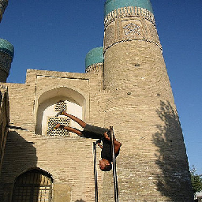
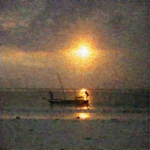
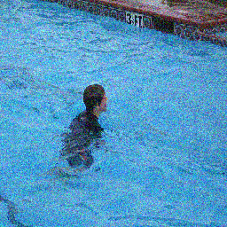
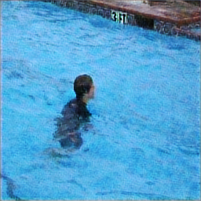
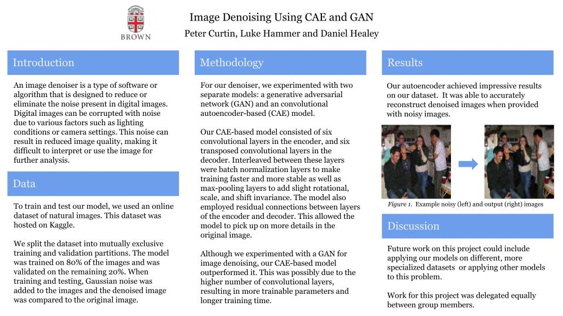

## Autoencoder Image Denoising

### Who
Peter Curtin (pcurtin1), Luke Hammer (lhammer), Daniel Healey (dhealey5)

### Introduction

For our final project, we decided to focus on the problem of image denoising. 

An image denoiser is a type of software or algorithm that is designed to reduce or eliminate the noise present in digital images. Digital images can be corrupted with noise due to various factors such as lighting conditions or camera settings. This noise can result in reduced image quality, making it difficult to interpret or use the image for further analysis. 

We focused on the problem of image denoising for natural images, experimenting with using a convolutional autoencoder and a GAN.

### Methodology

To train and test our model, we used an online dataset of natural images. This dataset was hosted on Kaggle.

We split the dataset into mutually exclusive training and validation partitions. The model was trained on 80% of the images and was validated on the remaining 20%. When training and testing, Gaussian noise was added to the images and the denoised image was compared to the original image.

For our denoiser, we experimented with two separate models: a generative adversarial network (GAN) and an convolutional autoencoder-based (CAE) model.

Our CAE-based model consisted of six convolutional layers in the encoder, and six transposed convolutional layers in the decoder. Interleaved between these layers were batch normalization layers to make training faster and more stable as well as max-pooling layers to add slight rotational, scale, and shift invariance. The model also employed residual connections between layers of the encoder and decoder. This allowed the model to pick up on more details in the original image. 

Although we experimented with a GAN for image denoising, our CAE-based model outperformed it. This was possibly due to the higher number of convolutional layers, resulting in more trainable parameters and longer training time.

### Results

Our autoencoder achieved impressive results on our dataset.  It was able to accurately reconstruct denoised images when provided with noisy images. 

Below is an example of the output of our denoiser. The leftmost image is the original image, the center image is the noisy image (the original with Gaussian random noise added), and the rightmost image is the denoised output image from out CAE-based model.

  

  

  

The above CAE-based model was trained for a total of 8 epochs on our natural image training dataset.

### Challenges

The primary challenge was determining the correct architecture for our model. Our initial model was a very basic CAE model with only a few convolutional layers and no residual layers. However, by increasing our model's complexity and adding residual layers, we were able to significantly improve our model's preformance.

Another challenge we faced was with the GAN. We were hoping that the GAN would preform well, however it did not meet our expectations. Because of this, we were forced to focus on the CAE-based model.

### Reflection

Future work on this project could include applying our models on different, more specialized datasets  or applying other models to this problem. 

Work for this project was delegated equally between group members.

Below is our final poster:

